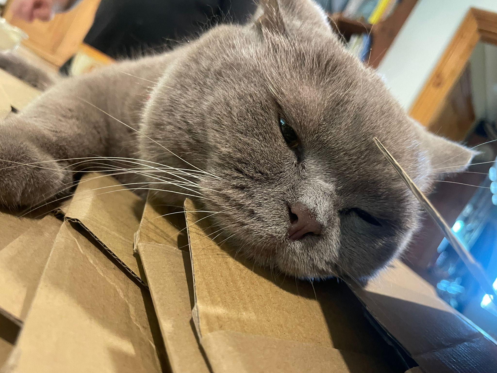
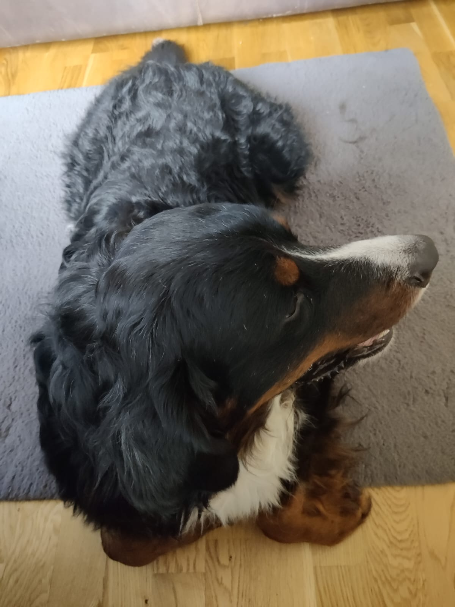
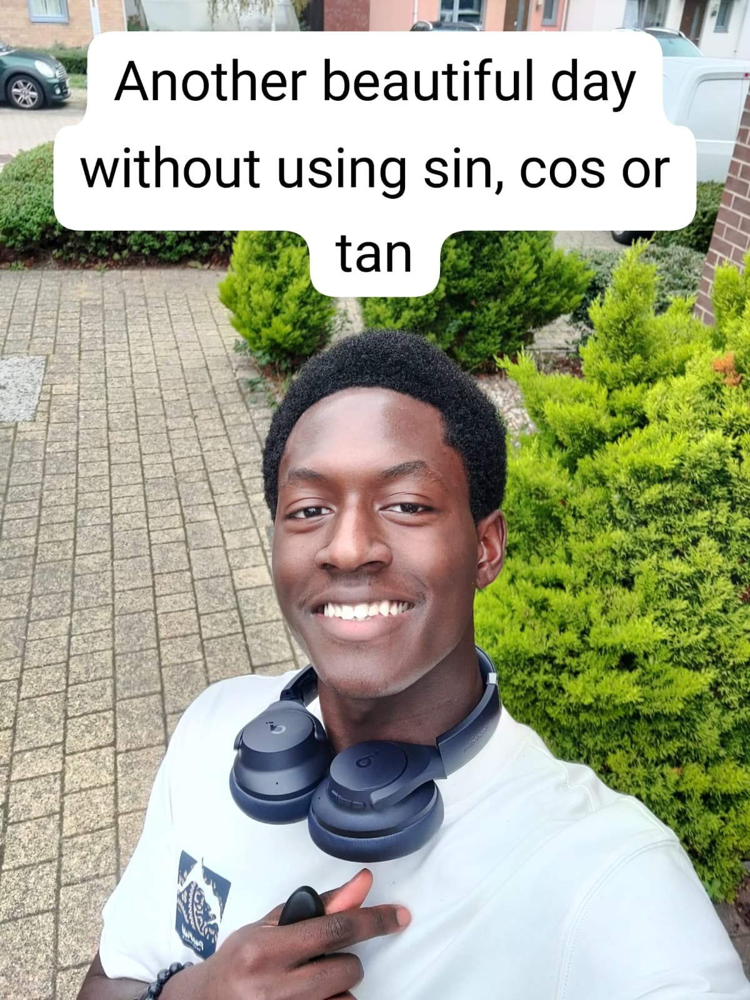

# COMP1850-Week1
First intro to CS programming @ Leeds

# All About Me
My name is Lani, hi!
> Chief rambler

Dog and cat lover, because why choose 1?

I _think_ I'm a rather interesting person, as I have had a lot of interests and continue to do so. I'm an **avid** reader, ranging from classic pieces of Literature like House of Leaves to fantastic Korean web novels like Absolutely Do Not Touch Eldmia Egga, which I'd reccomend, but sadly you cannot find through official channels without knowing the language.

When it comes to sports, I am no slouch either, I learned to swim just as soon as I learned to run, and I could 
#### never
forget how much I love dodgeball. The club is from 12-2pm at the Griphon Sports Center, free every Saturda. Come join! Ah, I also play basketball too.
So that's:
- Swimming
- Basketball
- Dodgeball

In terms  of _friends_ (CS students have those?!), mine vary greatly. There are friends globally who I've known for years through gaming and such (though do **NOT** get me started on that) and friends who Sixth Form delivered to me and I've kept in contact with. A few are doing gap years, but I'm just happy we made it outta there.

My main hobbies, as mentioned prior, tend to revolve around gaming and reading books. I do enjoy watching a few things, but my watchlist backlog is so long I don't know whether I should finish an anime or start a movie to cut it down. I've settled for downloading copious amounts of Columbo (detective murder mystery, older, hard reccomend) and _hoping_ there'll be time to watch it.

In terms of sixth form, I did the International Baccalaureate, also known as ***suffering!*** Having left that and come to uni, I understand fully that I will eventually have to get back into mathematics sooner rather than later, but I am enjoying the time without it for now. Look, aren't I so happy?

Regarding writing, my hobby ranges from taking pictures of infrastructure and scenery that I find interesting to mapping out stories for games that I would love to create. The easiest style of game to create would likely be a visual novel, through RenPy, as it is a fairly simple base to code from. I came to Leeds to further my coding and computing knowledge so that I can hone my skills for _any_ kind of Computer Science job, and living here so far does not make me regret my decision at all, it's pretty enjoyable so far.

If you ever see me around and I'm somehow
## not
rushing somewhere, please stop me and chat! I'm ambiverted, so occasionally outgoing, occasionally not, but I'm always ready to meet someone new. 

#### Thanks for reading!